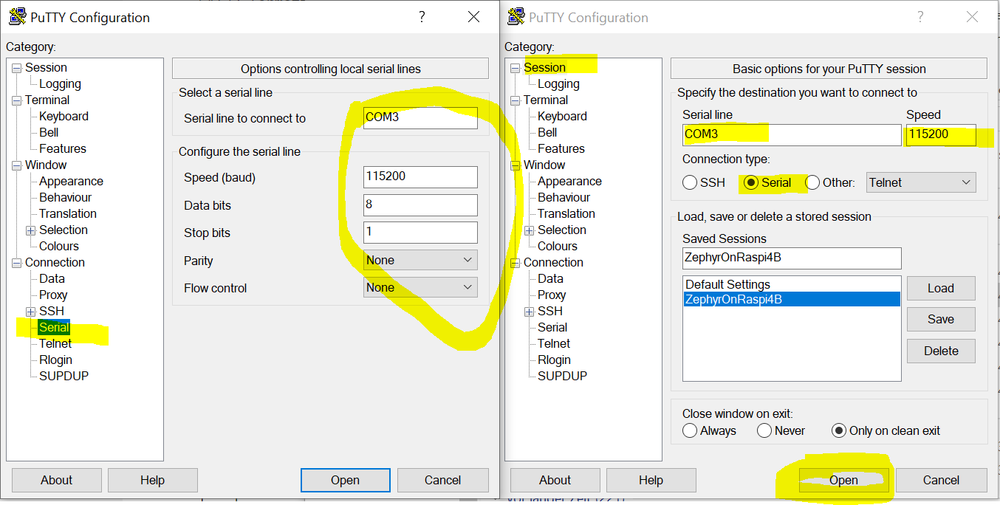
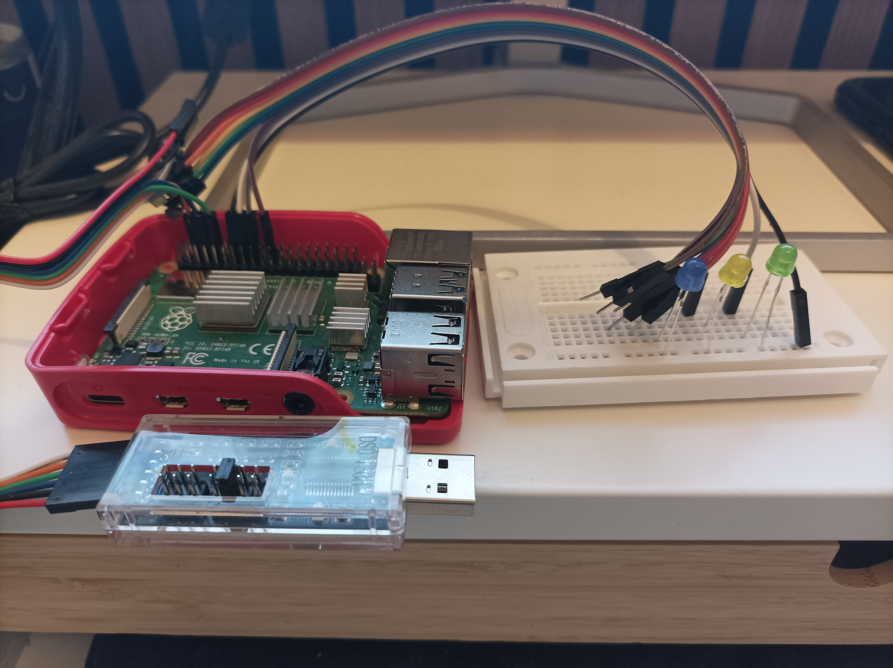

# Sample Rust/Zephyr RTOS application

A simple [Zephyr](https://www.zephyrproject.org/) application written in [Rust](https://doc.rust-lang.org/book/ch01-01-installation.html) running in Zephyr RTOS on a Raspberry 4 Model B board demonstrating how to let 3 connected LEDs flash and how to display some text on a connected screen via the boards UART serial port. Based on the sample application the process of writing Zephyr application with Rust is shown.

The application was tested with [Zephyr RTOS v3.5.99](https://www.zephyrproject.org/).

## Installation
Install [Rust](https://doc.rust-lang.org/book/ch01-01-installation.html) und run the following in order to add target `aarch64-unknown-none` for cross-compiling Rust lib for Raspberry 4 Model B (cf. [Rust Platform Support](https://doc.rust-lang.org/beta/rustc/platform-support.html) for supported targets)
```
~> rustup target add aarch64-unknown-none
```
For installing the Zephyr SDK please refer to the [Zephyr Getting Started Guide](https://docs.zephyrproject.org/latest/develop/getting_started/index.html).

## Build Application
We build our Zephyr application as a [Zephyr workspace application](https://docs.zephyrproject.org/latest/develop/application/index.html#application-types) for the Raspberry 4B target board `rpi_4b` by copying everything to `<zephyrproject>/<app name>` and
```
~> source <zephyrproject>/.venv/bin/activate
~> cd <zephyrproject>
~> west build -p always -b rpi_4b <app name>
```

## Run Application
Please follow [how to run Zephyr applications on Raspberry Pi 4 Model B](https://docs.zephyrproject.org/latest/boards/arm64/rpi_4b/doc/index.html), i.e.,
* copy Raspi 4B [specific files](rpi_4b) for [booting the device](https://www.raspberrypi.com/documentation/computers/config_txt.html) & loading the built Zephyr application's kernel to FAT32 formatted SD card's root folder together with
* the built Zephyr application binary located at `<zephyrproject>/build/zephyr/zephyr.bin` (already compiled binary [build/zephyr.bin](build/zephyr.bin) can be used)

## Configuring the Hardware - Device Tree Overlay
The 3 LEDs are connected to the board's [GPIO](https://www.raspberrypi.com/documentation/computers/raspberry-pi.html) pins: GPIO 23,24 & 25 respectively.
UART/serial to USB adapter is connected to pins GPIO 14 & 15.

All 3 LEDs are configured in the [device tree overlay](https://docs.zephyrproject.org/latest/build/dts/howtos.html#set-devicetree-overlays) - [boards/rpi_4b.overlay](boards/rpi_4b.overlay) altering Raspberry's [base devicetree](https://github.com/zephyrproject-rtos/zephyr/blob/main/boards/arm64/rpi_4b/rpi_4b.dts) based on its SOC's device tree of the [Broadcom BCM2711](https://github.com/zephyrproject-rtos/zephyr/blob/main/dts/arm64/broadcom/bcm2711.dtsi) in order to activate the board's [GPIO0](https://www.raspberrypi.com/documentation/computers/raspberry-pi.html) (GPIO 0 ~ 27) to control 3 LEDs connected to pins GPIO 23,24 & 25 as defined by aliases `led1`, `led2` & `led3` in the device tree overlay. The aliases can then be directly used in code.

## Configuring Zephyr kernel and subsystems - Kconfig
The [Kconfig fragment](https://docs.zephyrproject.org/latest/develop/application/index.html#kconfig-configuration) - [prj.conf](prj.conf) configures the Zephyr application build to include 
* (`CONFIG_GPIO`) GPIO drivers for controllong LEDs via GPIOs, 
* (`CONFIG_CONSOLE`) console drivers to been able to print output, and 
* (`CONFIG_UART_CONSOLE`) usage of one UART for console in order to been able to print to some serial display via console over UART serial port
For more Kconfig options please refer to [Kconfig search](https://docs.zephyrproject.org/latest/kconfig.html#kconfig-search).

## Using Rust with Zephyr
Zephyr's build system is heavily based on CMake and C. The idea to use Rust in this environment is to cross-compile all Rust code to some library and then call Rust functions from within the Zephyr applications [C main()](src/main.c) via bindings. The following process is based in ideas from [Using Non-C languages with Zephyr](https://github.com/tangybbq/non-c-on-zephyr) & [Embedding Rust Into Zephyr Firmware Using C-bindgen](https://www.zephyrproject.org/embedding-rust-into-zephyr-firmware-using-c-bindgen/).
In our Rust library [src/lib.rs](src/lib.rs), basically three modules with functions are defined for
* controlling the LEDs by calling Zephyr API C functions from within Rust via bindings ([src/led.rs](src/led.rs)),
* printing text to some display by calling Zephyr API C functions from within Rust via bindings ([src/display.rs](src/display.rs)), and
* configuring LED frequencies & delays and the text to be displayed ([src/config.rs](src/config.rs))

The sample Rust library can be cross-compiled for Raspberry 4 Model B target `aarch64-unknown-none` based on its [Cargo.toml](Cargo.toml) as follows:
```
~> cd <zephyrproject>/<app name>
~> cargo build --target aarch64-unknown-none --release
```

Based on [A little Rust with your C](https://docs.rust-embedded.org/book/interoperability/rust-with-c.html) C bindings [bindings/cbindings.h](bindings/cbindings.h) to Rust must be generated via `cbindgen` in order to be able to call our Rust library functions from within our Zephyr application's main():
```
~> cd <zephyrproject>/<app name>
~> cbindgen --output bindings/cbindings.h
```
The cbindgen configuration [cbindgen.toml](cbindgen.toml) is used for generating the bindings.

Conversely, based on [A little C with your Rust](https://docs.rust-embedded.org/book/interoperability/c-with-rust.html) Rust bindings [bindings/rustbindings.rs](bindings/rustbindings.rs) to [Zephyr API's C functions](https://docs.zephyrproject.org/latest/doxygen/html/index.html) must be genered via `bindgen` in order to be able to make Zephyr OS function calls from within Rust:
```
~> cd <zephyrproject>/<app name>
~> bindgen bindings/bindings.h -o bindings/rustbindings.rs --use-core --ctypes-prefix=cty --experimental --wrap-static-fns -- -I<zephyrproject>/zephyr/include -I<zephyrproject>/build/zephyr/include/generated -DCONFIG_ARM64 -DCONFIG_MP_MAX_NUM_CPUS -DCONFIG_PRIVILEGED_STACK_SIZE -DCONFIG_SYS_CLOCK_TICKS_PER_SEC -DCONFIG_SYS_CLOCK_MAX_TIMEOUT_DAYS -DCONFIG_NUM_COOP_PRIORITIES=1
```
Note that for all of Zephyr's `static inline` functions, bindgen will generate non-static, non-inline wrapper functions in [extern.c](bindings/extern.c) that need to be compiled together with the Zephyr application in order to be able to call these functions from within Rust

## Display UART/serial Output
The UART serial output can be displayed at a computer connected to the Raspberry board by using an USB to UART serial TTL adapter and running [Putty](https://www.chiark.greenend.org.uk/~sgtatham/putty/latest.html) on the connected computer with the following configuration:



## Hardware Setup
The 3 LEDs are connected to the boards GPIO pins 23,24 & 25 respectively.
The UART serial to USB adapter is connected to GPIO pins 14 & 15.



```
.
├── CMakeLists.txt                  # C instructions/build system's entry point for building the Zephyr application
├── Cargo.toml                      # Rust instructions/build system's entry point for building the Rust library
├── VERSION                         # version information of Zephyr application
├── bindings
│   ├── bindings.h                  # For functions & structs of all #included C headers corresponding Rust bindings to C are generated
│   ├── cbindings.h                 # C bindings to Rust library's functions
│   ├── extern.c                    # allows Rust bindings to static inline C functions
│   └── rustbindings.rs             # Rust bindings to C functions & structs
├── boards
│   └── rpi_4b.overlay              # device tree overlay activating GPIO on Raspi 4B board for controlling connected LEDs
├── build
│   └── zephyr.bin                  # already built Zephyr application binary ready to be deployed to and tested on Raspi 4B
├── cbindgen.toml                   # configuration file for cbindgen
├── prj.conf                        # Kconfig fragment specifying application-specific Zephyr features that need to be included in the application build
├── rpi_4b                          # Raspi 4B specific files for booting the device & loading the Zephyr application's kernel
│   ├── bcm2711-rpi-4-b.dtb
│   ├── bootcode.bin
│   ├── config.txt
│   └── start4.elf
└── src
    ├── config.rs                   # Rust module for reading the app's configuration
    ├── display.rs                  # Rust module for printing text to the display
    ├── led.rs                      # Rust module for controlling up to three LEDs
    ├── lib.rs                      # Rust library crate root combining all three Rust modules
    └── main.c                      # Zephyr application entry point
```
